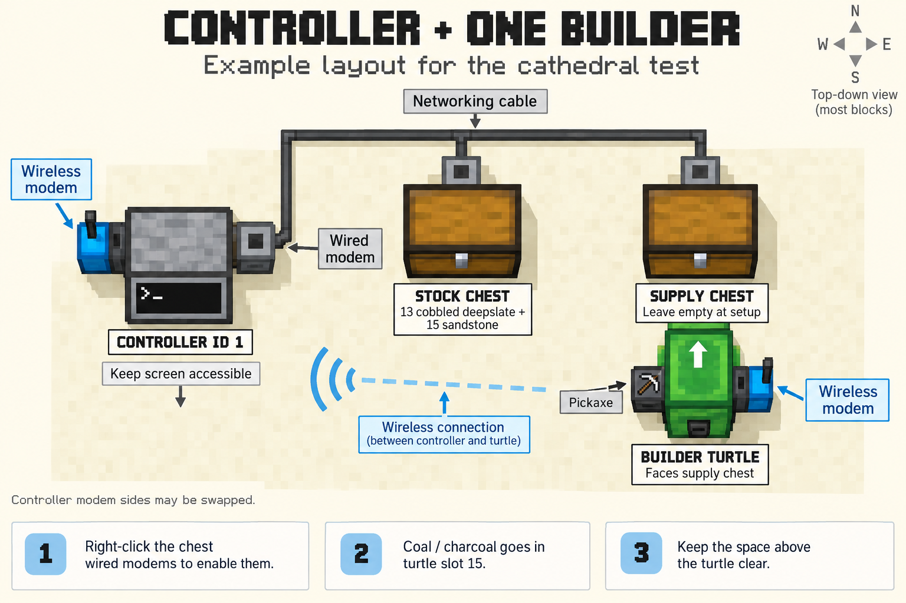

# Start here: controller 1 and one builder

Use **one of your seven online workers** for this first test: a small, 28-block
cathedral detail. Leave the other six parked outside the work area. You do not
need to reinstall them. These steps update the controller and chosen worker to
**release 0.10.3 or later**.

## 1. Place the hardware

Gather:

- **3 Wired Modems** and enough **Networking Cable** to join them.
- **2 separate chests**.
- **13 Cobbled Deepslate** and **15 Sandstone** — ordinary blocks, not stairs,
  slabs, cut sandstone, or polished deepslate.
- **16 coal or charcoal** for the chosen turtle.
- A wireless modem attached to the controller, and a builder turtle already
  equipped with a **pickaxe and wireless modem**.



[Open the drawing at full size](images/controller-layout.png).
The drawing shows connections, not exact distances. The controller's modem sides
can be swapped; leave its screen accessible. If you copy the drawing's directions,
align its **N** arrow with north in your world first. Otherwise enter your
turtle's actual direction in step 3.

1. Place the two chests near the controller, with **at least one empty block
   between them** so they do not join into a double chest.
2. Call one the **stock chest**. Right-click it, put 13 cobbled deepslate and
   15 sandstone inside, and close it. This is where materials begin.
3. Call the other the **supply chest**. Leave it empty. The controller will move
   materials into it, and the turtle will collect them here.
4. Hold a Wired Modem. Hold **Shift** and right-click a free side of the
   controller to attach it. Leave its wireless modem attached too.
5. Attach another Wired Modem to the back or side of each chest. Use
   **Shift + right-click** when placing onto a chest, so you place the modem
   instead of opening the chest.
6. Join all three wired modems with Networking Cable. Make one continuous cable
   network: controller → stock chest → supply chest. Leave no gaps.
7. With an empty hand, **right-click each chest's wired modem** to enable it.
   Minecraft chat should report a connected peripheral and its name. If it says
   disconnected, right-click that modem again. Write down which name belongs to
   each chest; you can match those names in setup. The wired modems expose the
   chests to the controller; the wireless modems communicate with the turtle.
   See [CC:Tweaked's wiring instructions](https://tweaked.cc/module/peripheral.html).
8. Park the chosen turtle immediately beside the supply chest, at the same
   height, with its **front facing the chest**. The chest must touch the
   turtle's front, with no empty block between them. This parking place is its
   **depot**.
9. Right-click the turtle. In its **4 × 4 inventory**, put all 16 coal or charcoal
   in **slot 15: bottom row, third square from the left**. Leave slot 16 empty
   and the other slots available for materials. Close the turtle screen.

```text
Turtle inventory — read left to right:

  1    2    3    4
  5    6    7    8
  9   10   11   12
 13   14  [15]  16
           ↑
       coal here
```

Keep the block **directly above the turtle empty**. Do not put a fuel chest or
cable above it. Clear its route to the building area of blocks, other turtles,
and players. The turtle needs room to rise and travel.

## 2. Record the build corner

Choose a flat **8 × 8** patch near the depot, outside the chests and cables.
Leave the layer where new blocks will go empty, plus **two empty blocks above
that layer**. This test does not clear a site for you.

The first corner is the **northwest corner**. The footprint runs from there
**7 blocks east and 7 blocks south**: counting the corner itself makes 8 × 8.

1. Close computer and chest screens. Press **F3** in Minecraft Java to show
   coordinates. If your function keys control other actions, try **Fn + F3**.
2. Look at the ground block under your chosen northwest corner. Read the three
   numbers labelled **Targeted Block**, usually on the right of the F3 screen.
   They describe the block under your crosshair. Do not copy the player's
   `XYZ` or `Block` position.
3. Write down the targeted block's **x**, **y**, and **z**, in that order.
   Add **1 to y** so the new blocks sit on the ground. For example, ground at
   `100 64 200` means a build corner of `100 65 200`. Use your own numbers.
4. Keep that resulting line as your **build corner**. Keep any minus signs.

Check directions with F3's **Facing** line as you turn your player: east
increases x; south increases z. A normal Minecraft compass points toward world
spawn, so do not use its needle to choose north. See
[Minecraft's explanation of the compass](https://www.minecraft.net/en-us/article/taking-inventory--compass).

## 3. Record the turtle's position and direction

Do this after parking the turtle at its depot. Do not move or rotate it after
recording these values.

1. With F3 open, point your crosshair at the **turtle itself**.
2. Copy its **Targeted Block** coordinates as **turtle position**. This time,
   **do not add 1 to y**: you want the block the turtle occupies.
3. Below the targeted block's name, look for `facing: north`, `east`, `south`,
   or `west`. Write down this **turtle facing** value.
4. If those details do not show facing, stand behind the turtle and look straight
   along the line **from the turtle toward the supply chest**. Read your player's
   F3 **Facing** direction. That is the direction the turtle must face. Check
   that its front actually points at the chest.
5. Press F3 again to hide the debug screen.

In the drawing's example only, the turtle faces north. Your layout may differ.
GPS can supply position if you already have working GPS hosts, but setup still
asks for facing. You do not need GPS hosts for this test; enter your recorded
turtle coordinates when asked.

## 4. Update and configure controller 1

All commands here go **inside Minecraft**, in the computer you right-click.
Do not type them in your Mac's Terminal, Minecraft chat, or this repository.

1. Right-click **controller 1** to open its screen.
2. If Autobuilder is running, press **Q** to quit it. You should see the CraftOS
   command prompt, typically `>`. If you already see that prompt, continue.
3. Type this and press **Enter**:

   ```text
   /update.lua
   ```

4. Wait for the update to finish successfully. Then type this and press Enter:

   ```text
   reboot
   ```

5. Wait for Autobuilder's numbered menu. At its command input, type **`setup`**
   and press Enter. This goes into the **running app**; do not press Q first.
6. Setup lists chests by number and shows their contents. For **supply chest**,
   enter the number beside the **empty** chest and press Enter.
7. For **stock chest**, enter the number beside the chest showing your cobbled
   deepslate and sandstone and press Enter. These numbers identify chests;
   they are not computer IDs or the controller menu choices.
8. When asked for the **build corner**, enter your three recorded build-corner
   numbers on one line, separated by spaces, and press Enter.
9. Read the summary. If it matches your chests and corner, type **`yes`** when
   asked to save and press Enter.

Setup returns to Autobuilder automatically. Leave controller 1 running while you
configure the turtle. A message about waiting for a builder is expected here;
you have not started the test yet.

## 5. Update and configure just the chosen worker

1. Close controller 1's screen and right-click the **chosen builder turtle**.
2. Press **Q** if Autobuilder is running, to reach the CraftOS `>` prompt.
3. Type **`/update.lua`**, press Enter, and wait for success.
4. Type **`reboot`** and press Enter. Wait for Autobuilder to start and connect
   to controller 1.
5. In the running worker app, type **`setup`** and press Enter.
6. Setup reads the supply settings from controller 1. If GPS is available, check
   the position it reports against the parked turtle. If asked for **turtle
   block position**, enter your recorded turtle position as `x y z` on one line
   and press Enter.
7. When asked for **facing**, enter your recorded `north`, `east`, `south`, or
   `west` and press Enter.
8. When asked whether it is parked facing the selected supply chest, check the
   physical turtle and chest. Type **`yes`** only if they match.
9. Check the summary and fuel instructions. Type **`yes`** to save and press
   Enter. This also lets setup consume coal or charcoal from slot 15 to fill
   the turtle's fuel to at least 1,000 for this test. Setup does
   not move the turtle.

The worker returns to Autobuilder automatically. Leave it running. Setup enables
this existing worker to build; it does not need another installation profile.

## 6. Check, then start the small test

1. Return to **controller 1** and right-click its screen.
2. Type **`1`** and press Enter. This checks readiness and gives the next action.
   Resolve anything it says is missing, then type `1` again.
3. Once the check is ready, type **`2`** and press Enter to start the small pilot.
4. Watch the turtle collect materials and build the 28-block detail. Keep
   yourself and the other six workers out of its path. Stay nearby so the
   controller, chests, route, and building area remain loaded in Minecraft.

The pilot blueprint is included. Menu `2` handles importing, material preparation,
and starting it once readiness checks pass. You do not need `wget`, a separate
blueprint download, or `import`, `analyze`, or `prepare` commands. Setup or reboot
alone does not start the pilot.

| Type in controller 1's running app | What it does |
| --- | --- |
| `1` | Check setup and show guidance (`guide`) |
| `2` | Start the small pilot (`pilot start`) |
| `3` | Pause the pilot (`pilot pause`) |
| `4` | Resume the pilot (`pilot resume`) |
| `5` | Show workers |
| `6` | Show jobs |
| `7` | Open setup (`setup`) |

This confirms a small building workflow. The **full cathedral is not supported
as an unattended, whole-building run**. Setup does not install GPS hosts or a
chunk loader.

## If a step does not work

| What you see | Exactly where to act |
| --- | --- |
| `No such program` after typing `pilot start`, `guide`, or `setup` | You may be at CraftOS. On that in-game computer, type `reboot`, wait for Autobuilder, then enter the app command. If its menu is still old, press Q and run `/update.lua`, then `reboot`. |
| Controller needs two inventories | Close **controller 1's screen**. Check all three wired modems and the continuous cable. Right-click each **chest's wired modem** until it reports connected. Keep the chests separate. Open controller 1 and type `setup` again. |
| Neither listed chest is empty | Open the physical **supply chest** and empty it. Keep the 28 blocks in the **stock chest**. Retry `setup` on controller 1. |
| Worker cannot find controller settings | Leave **controller 1** running after its setup is saved. Check that the chosen worker has connected and both have wireless modems. Type `setup` on the worker again. Both must be updated. |
| No chest in front of worker | Close the **worker screen**. Make its front touch the supply chest at the same height. If you reposition it, record new turtle coordinates and facing before retrying `setup`. |
| Controller is waiting for a builder | On the **chosen worker**, finish setup and leave Autobuilder running. Return to **controller 1** and type `1` again after it connects. |
| Worker setup saved but says fuel is insufficient | Open the **chosen turtle's inventory**, put 16 coal or charcoal in slot 15, then run `setup` in its app again. |
| Turtle cannot move or reports low fuel | On **controller 1**, type `3` to pause. Check the turtle's slot 15 and clear the space above it and its route. Keep its body in place; do not break and replace it during a job. Review the reported reason before resuming with `4`. |
| Setup refuses because work or recovery is pending | Read the message on that computer. Finish or recover the existing job before changing setup; pausing alone does not release it. Keep the saved state files. See [recovery notes](quick-setup.md#saved-settings-and-interruptions). |

If an update fails, keep its exact error message. Do not continue to setup on
an old release: see [installation and update instructions](installation.md).
